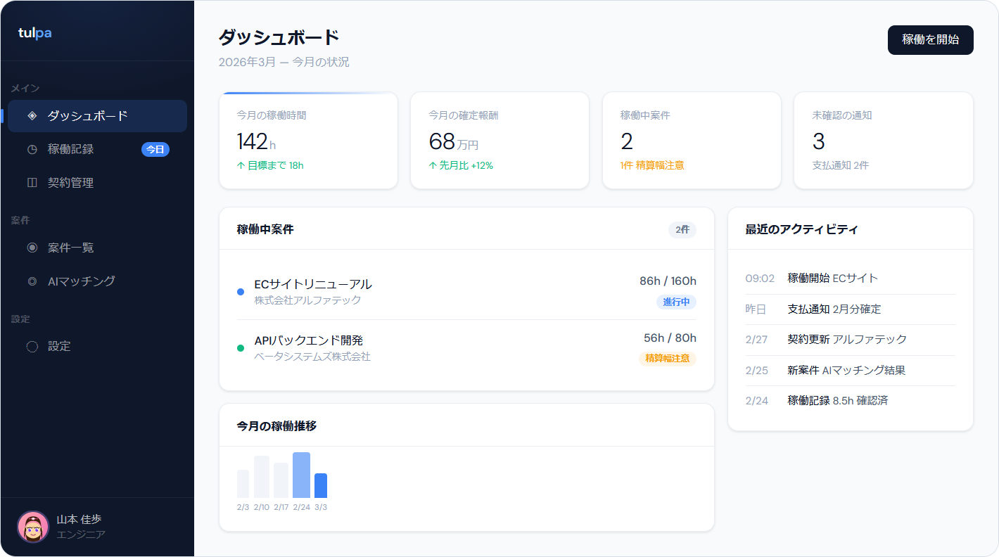
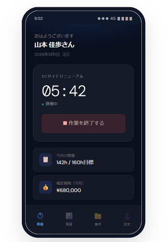

# Tulpa


> 案件を中心に、フリーランスエンジニアとエージェントの業務をつなぐ OSS

Tulpa は、フリーランスエージェント業務を整理するためのオープンソースソフトウェアです。案件、契約、稼働記録を案件中心でつなぎ、属人的になりやすい運用をシンプルに扱える状態を目指します。

AI はオプション機能として扱います。Tulpa のコアは、AI がなくても動く業務基盤です。

---

## まず読む場所

- プロダクト全体像: [docs/requirements.md](docs/requirements.md)
- ドキュメント入口: [docs/README.md](docs/README.md)
- 実装ロードマップ: [docs/architecture/mvp-implementation-roadmap.md](docs/architecture/mvp-implementation-roadmap.md)
- 進捗管理: [docs/architecture/mvp-wbs.md](docs/architecture/mvp-wbs.md)
- レンタルサーバ前提の実装制約: [docs/architecture/hosting-and-operations-constraints.md](docs/architecture/hosting-and-operations-constraints.md)
- AI 実装時の読書順: [docs/context-loading-guide.md](docs/context-loading-guide.md)

---

## Tulpa が解決したいこと

- 稼働記録、契約、クライアント情報が別々のツールに散らばる状態を減らす
- エンジニア、エージェント、クライアントのやり取りを案件単位で追いやすくする
- 月次の稼働報告と確認フローをスマホ前提で扱いやすくする
- スキルシートと案件情報を、将来のマッチング支援へつながる形で管理する

---

## 画面イメージ

エンジニア向けダッシュボードのモックです。案件、稼働状況、通知を一画面で把握できる構成を目指しています。



スマホ向けモックです。PWA を前提に、移動中でも主要導線へすぐ入れる構成を想定しています。



現在のモックには将来機能を含む場合があります。

---

## MVP の対象範囲

MVP では、まず次を対象にします。

- 4 ロールの認証・認可
- クライアント企業、担当者、案件、契約の管理
- エンジニア管理とスキルシート
- 稼働記録の入力
- 月次稼働報告の提出、差戻し、確認
- PWA 基本対応
- 年間カレンダービュー

次は MVP 後の拡張です。

- 支払通知、請求書の自動生成
- CRM 機能
- Claude API によるマッチング支援
- Slack 連携
- 外部サービス連携

詳細は [docs/requirements.md](docs/requirements.md) を参照してください。

---

## 開発の進め方

Tulpa は、要件と設計を先に固定し、その上で AI を使って実装を進める構成を取っています。

```text
Requirements
  -> Architecture Docs
  -> MVP Roadmap
  -> MVP WBS
  -> ExecPlan
  -> Implementation
```

各文書の役割は次の通りです。

- [AGENTS.md](AGENTS.md)
  AI エージェント向けの原則、用語、実装制約
- [docs/requirements.md](docs/requirements.md)
  プロダクト全体の SSOT
- [docs/architecture/mvp-implementation-roadmap.md](docs/architecture/mvp-implementation-roadmap.md)
  マイルストーン単位の実装順
- [docs/architecture/mvp-wbs.md](docs/architecture/mvp-wbs.md)
  簡易進捗管理
- [docs/architecture/hosting-and-operations-constraints.md](docs/architecture/hosting-and-operations-constraints.md)
  レンタルサーバ前提での実装制約と運用前提
- [.agents/PLANS.md](.agents/PLANS.md)
  ExecPlan の仕様

---

## 技術スタック

軽量構成を維持し、レンタルサーバーでも動かしやすい構成を目指します。

| カテゴリ | 技術 |
|------|------|
| バックエンド | PHP 8.2+ / Laravel 12 |
| フロントエンド | Alpine.js + htmx / Tailwind CSS |
| データベース | MySQL 8.0+ / MariaDB 10.6+ |
| オプション | Claude API / Slack API |
| モバイル | PWA |

---

## セットアップ

```bash
git clone https://github.com/yama/tulpa.git
cd tulpa
composer install --no-dev
cp .env.example .env
php artisan key:generate
php artisan migrate
```

アプリケーションのセットアップ手順は、実装の進行に合わせて追加します。

---

## リポジトリ案内

- プロダクトと設計の文書: [docs/README.md](docs/README.md)
- AI エージェント向けガイド: [AGENTS.md](AGENTS.md)
- ExecPlan 仕様: [.agents/PLANS.md](.agents/PLANS.md)

---

## ライセンス

MIT License
