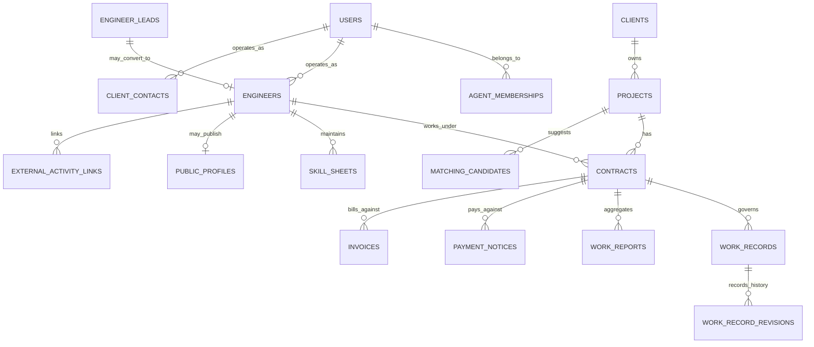

# 暫定 ER 図

この文書は、Tulpa の主要エンティティ関係を一般的な ER 図の形式で示すための暫定成果物です。
既存文書の内容を視覚化したものであり、モデル確定版ではありません。

---

## 1. 文書ステータス

| 項目 | 内容 |
|------|------|
| 確定度 | 暫定 |
| ダミー利用 | あり |
| SSOT | [../data-model.md](../data-model.md), [../access-control-and-roles.md](../access-control-and-roles.md), [../workflows/project-contract-lifecycle.md](../workflows/project-contract-lifecycle.md) |
| 主な用途 | ポートフォリオ提示、全体像の共有、詳細設計の入口 |

ダミー利用とは、実テーブル名や最終的な FK 制約ではなく、設計意図を伝えるための仮置き表現を含むことを意味します。

---

## 2. この文書で伝えたいこと

この ER 図で伝えたいのは次の 3 点です。

1. Tulpa は `Client -> Project -> Contract` を中心に組み立てる
2. 稼働記録、月次稼働報告、請求、支払は `Contract` を参照起点に分かれる
3. 見込みデータ、確定データ、公開データを同じ塊にしない

---

## 3. 前提

- MVP の中心は `Client -> Project -> Contract -> WorkRecord / WorkReport` の流れ
- `EngineerLead` は見込み段階、`Engineer` は正式登録後の主体として分ける
- `Invoice` と `PaymentNotice` は要件上は存在するが、MVP 実装順では後段の可能性がある
- 公開プロフィールや外部連携は疎結合に置く

---

## 4. 暫定 ER 図

---

## 5. 主要エンティティの読み取りメモ

### 4.1 `Client`

- クライアント企業または発注主体
- 案件の親であり、エージェント画面での主要な閲覧軸

### 4.2 `Project`

- 案件の単位
- 契約、候補者検討、履歴参照の中心

### 4.3 `Contract`

- 契約書ファイルではなく、契約条件の業務レコード
- 稼働記録、稼働報告、請求、支払の参照起点
- `contract_party_type` を持つ前提

### 4.4 `WorkRecord`

- 1 日単位または入力単位の稼働記録
- 最新状態を持つ本体

### 4.5 `WorkRecordRevision`

- `WorkRecord` の修正履歴
- 監査と差分確認のために分離

### 4.6 `WorkReport`

- 月次稼働報告
- `draft` `submitted` `returned` `confirmed` を持つ前提

---

## 6. ダミーを含む箇所

- `USERS` とロール別エンティティの分け方は仮置き
- `AGENT_MEMBERSHIPS` `MATCHING_CANDIDATES` `EXTERNAL_ACTIVITY_LINKS` などの名称は調整余地あり
- `Invoice` `PaymentNotice` の FK 粒度は今後の請求設計で変わる可能性あり

---

## 7. 未確定事項との接続

- 契約変更の履歴粒度は [../open-questions.md](../open-questions.md) の契約関連論点に依存
- 休憩、日跨ぎ、差戻し単位は [../workflows/work-record-and-report-design.md](../workflows/work-record-and-report-design.md) の未確定事項に依存
- 公開プロフィール周辺の公開範囲は [../access-control-and-roles.md](../access-control-and-roles.md) に従う

---

## 8. この文書の受け入れ条件

1. Tulpa の中心データが「クライアント中心でつながる」ことが図で伝わる
2. `Contract` が稼働系の起点であることが読み取れる
3. ダミーや仮置きを確定仕様と誤読しにくい
