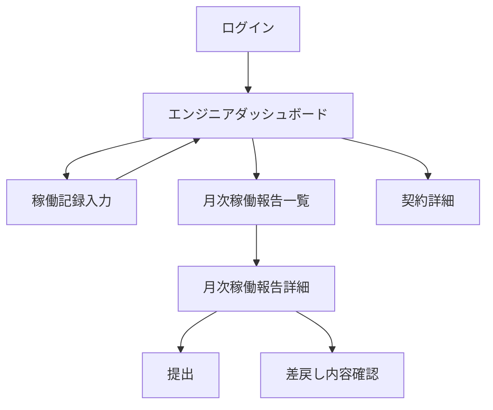
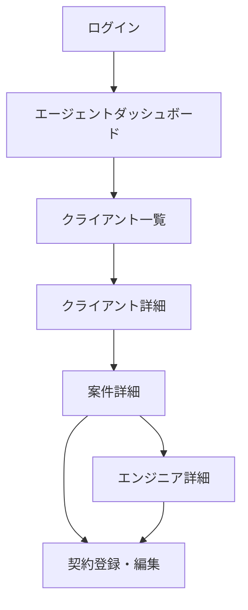
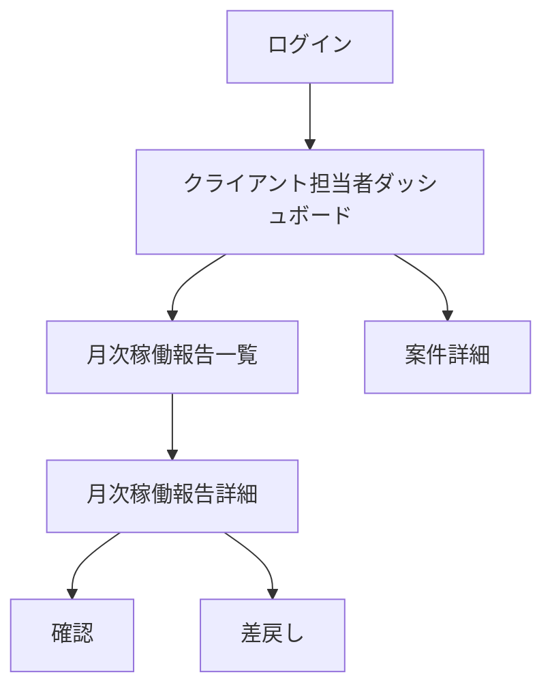

# 暫定画面一覧・画面遷移図

この文書は、Tulpa の画面設計を一般的な成果物として見せやすくするための暫定版です。
画面数、画面名、遷移条件には仮置きを含みます。

---

## 1. 文書ステータス

| 項目 | 内容 |
|------|------|
| 確定度 | 暫定 |
| ダミー利用 | あり |
| SSOT | [../ui-and-screen-design.md](../ui-and-screen-design.md), [../access-control-and-roles.md](../access-control-and-roles.md) |
| 主な用途 | 画面全体像の説明、主要導線の共有 |

---

## 2. この文書で伝えたいこと

この文書で伝えたいのは、画面数の多さではなく導線の単純さです。

1. エンジニアは稼働記録と月次稼働報告が中心
2. エージェントはクライアント、案件、契約を横断できる
3. クライアント担当者は確認対象だけに絞る

---

## 3. 前提

- MVP ではロールごとに見える画面を強く分ける
- 状態はサーバー側で持ち、htmx による部分更新を許容する
- 公開プロフィールや AI 機能は主要導線からは外してよい

---

## 4. 画面一覧

### 3.1 エンジニア向け

| 画面 ID | 画面名 | 主目的 | 備考 |
|------|------|------|------|
| `ENG-DASH-01` | ダッシュボード | 今日の稼働状況確認 | MVP 中心 |
| `ENG-WREC-01` | 稼働記録入力 | 作業開始・終了の入力 | MVP 中心 |
| `ENG-WREP-01` | 月次稼働報告一覧 | 月ごとの提出状況確認 | MVP 中心 |
| `ENG-WREP-02` | 月次稼働報告詳細 | 提出、差戻し確認 | MVP 中心 |
| `ENG-CONTRACT-01` | 契約詳細 | 契約条件の確認 | MVP 中心 |
| `ENG-SKILL-01` | スキルシート | スキル情報の編集 | 後続寄り |

### 3.2 エージェント向け

| 画面 ID | 画面名 | 主目的 | 備考 |
|------|------|------|------|
| `AGT-DASH-01` | ダッシュボード | 全体把握 | MVP 中心 |
| `AGT-CLIENT-01` | クライアント一覧 | クライアント軸の閲覧 | MVP 中心 |
| `AGT-CLIENT-02` | クライアント詳細 | 案件、契約の起点 | MVP 中心 |
| `AGT-PROJECT-01` | 案件詳細 | 契約と候補者の確認 | MVP 中心 |
| `AGT-CONTRACT-01` | 契約登録・編集 | 契約条件の管理 | MVP 中心 |
| `AGT-ENGINEER-01` | エンジニア詳細 | 契約、稼働の横断確認 | MVP 中心 |

### 3.3 クライアント担当者向け

| 画面 ID | 画面名 | 主目的 | 備考 |
|------|------|------|------|
| `CLI-DASH-01` | ダッシュボード | 自分に関係する確認待ちの把握 | 最小構成 |
| `CLI-WREP-01` | 月次稼働報告一覧 | 確認対象の月次報告一覧 | MVP 中心 |
| `CLI-WREP-02` | 月次稼働報告詳細 | 確認、差戻し | MVP 中心 |
| `CLI-PROJECT-01` | 案件詳細 | 自社案件の状況確認 | 最小構成 |

---

## 5. 主要遷移

### 4.1 エンジニア導線

### 4.2 エージェント導線

### 4.3 クライアント担当者導線

---

## 6. ダミーを含む箇所

- 画面 ID は説明用の仮採番
- ログイン後の初期画面分岐は仮置き
- エージェント向けの一覧画面分割は今後統合・分離の可能性あり
- クライアント担当者向け案件詳細の必要最小項目は未確定

---

## 7. 未確定事項の扱い

- 画面分割の仮置きは、まず導線整理のために置いている
- 権限や運用が確定したら、統合できる画面は減らす
- 実装に影響する未確定事項は [../open-questions.md](../open-questions.md) と合わせて管理する

---

## 8. 画面設計で今後詰めること

1. 一覧と詳細の責務分離
2. `htmx` の部分更新対象
3. 権限エラー時の遷移
4. 差戻し後の再提出導線
5. 公開プロフィール画面を MVP 主要導線に含めるかどうか

---

## 9. この文書の受け入れ条件

1. ロールごとの主要画面が 1 枚で俯瞰できる
2. 稼働記録から月次稼働報告までの導線が追える
3. 仮置きの画面分割を確定仕様と誤読しにくい
